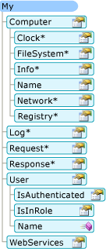

# How My Depends on Project Type (Visual Basic)
`My` macht nur Objekte verfügbar, die für einen bestimmten Projekttyp erforderlich sind.  So ist z. B. das `My.Forms`\-Objekt in einer Windows Forms\-Anwendung verfügbar, in einer Konsolenanwendung jedoch nicht.  In diesem Thema wird beschrieben, welche `My`\-Objekte in den einzelnen Projekttypen verfügbar sind.  
  
## My in Windows\-Anwendungen und Websites  
 `My` macht nur Objekte verfügbar, die für den aktuellen Projekttyp erforderlich sind.  In der folgenden Abbildung wird als Beispiel das `My`\-Objektmodell in einem Windows Forms\-Projekt dargestellt.  
  
   
  
 In einem Websiteprojekt macht `My` Objekte verfügbar, die für Webentwickler relevant sind \(z. B. das `My.Request`\-Objekt und das `My.Response`\-Objekt\). Nicht relevante Objekte wie das `My.Forms`\-Objekt werden hingegen nicht angezeigt.  In der folgenden Abbildung wird das `My`\-Objektmodell in einem Websiteprojekt dargestellt:  
  
   
  
## Details zu einzelnen Projekttypen  
 In der folgenden Tabelle wird aufgelistet, welche `My`\-Objekte standardmäßig für die acht folgenden Projekttypen verfügbar sind: Windows\-Anwendung, Klassenbibliothek, Konsolenanwendung, Windows\-Steuerelementbibliothek, Web\-Steuerelementbibliothek, Windows\-Dienst, leeres Projekt und Website.  
  
 Es gibt drei Versionen des `My.Application`\-Objekts, zwei Versionen des `My.Computer`\-Objekts und zwei Versionen des `My.User`\-Objekts. Weitere Informationen zu diesen Versionen finden sich in den Fußnoten am Ende der Tabelle.  
  
||||||||||  
|-|-|-|-|-|-|-|-|-|  
|My\-Objekt|Windows\-Anwendung|Klassenbibliothek|Konsolenanwendung|Windows\-Steuerelementbibliothek|Web\-Steuerelementbibliothek|Windows\-Dienst|Leer|Website|  
|`My.Application`|**Ja** 1|**Ja** 2|**Ja** 3|**Ja** 2|Nein|**Ja** 3|Nein|Nein|  
|`My.Computer`|**Ja** 4|**Ja** 4|**Ja** 4|**Ja** 4|**Ja** 5|**Ja** 4|Nein|**Ja** 5|  
|`My.Forms`|**Ja**|Nein|Nein|**Ja**|Nein|Nein|Nein|Nein|  
|`My.Log`|Nein|Nein|Nein|Nein|Nein|Nein|Nein|**Ja**|  
|`My.Request`|Nein|Nein|Nein|Nein|Nein|Nein|Nein|**Ja**|  
|`My.Resources`|**Ja**|**Ja**|**Ja**|**Ja**|**Ja**|**Ja**|Nein|Nein|  
|`My.Response`|Nein|Nein|Nein|Nein|Nein|Nein|Nein|**Ja**|  
|`My.Settings`|**Ja**|**Ja**|**Ja**|**Ja**|**Ja**|**Ja**|Nein|Nein|  
|`My.User`|**Ja** 6|**Ja** 6|**Ja** 6|**Ja** 6|**Ja** 7|**Ja** 6|Nein|**Ja** 7|  
|`My.WebServices`|**Ja**|**Ja**|**Ja**|**Ja**|**Ja**|**Ja**|Nein|Nein|  
  
 1 Windows Forms\-Version von `My.Application`.  Von der Konsolenversion abgeleitet \(siehe Fußnote 3\). Bietet zusätzlich Unterstützung für Interaktionen mit den Fenstern der Anwendung, und stellt das [!INCLUDE[vbprvb](../../../csharp/programming-guide/concepts/linq/includes/vbprvb_md.md)]\-Anwendungsmodell bereit.  
  
 2 Bibliotheksversion von `My.Application`.  Stellt die grundlegende Funktionalität für eine Anwendung bereit, insbesondere Member für das Schreiben in das Anwendungsprotokoll und den Zugriff auf Anwendungsinformationen.  
  
 3 Konsolenversion von `My.Application`.  Ist von der Bibliotheksversion abgeleitet \(siehe Fußnote 2\) und bietet zusätzliche Member für den Zugriff auf die Befehlszeilenargumente der Anwendung und ClickOnce\-Bereitstellungsinformationen.  
  
 4 Windows\-Version von `My.Computer`.  Ist von der Server\-Version abgeleitet \(siehe Fußnote 5\) und bietet Zugriff auf nützliche Objekte auf Clientrechnern, beispielsweise Tastatur, Bildschirm und Maus.  
  
 5 Serverversion von `My.Computer`.  Stellt grundlegenden Informationen zum Computer bereit, z. B. den Computernamen, bietet Zugriff auf die Uhr usw.  
  
 6 Windows\-Version von `My.User`.  Dieses Objekt ist der aktuellen Identität des Threads zugeordnet.  
  
 7 Webversion von `My.User`.  Dieses Objekt ist der Benutzeridentität der aktuellen HTTP\-Anforderung für die Anwendung zugeordnet.  
  
## Siehe auch  
 <xref:Microsoft.VisualBasic.ApplicationServices.ApplicationBase>   
 <xref:Microsoft.VisualBasic.Devices.Computer>   
 <xref:Microsoft.VisualBasic.Logging.Log>   
 <xref:Microsoft.VisualBasic.ApplicationServices.User>   
 [Customizing Which Objects are Available in My](../../../visual-basic/developing-apps/customizing-extending-my/customizing-which-objects-are-available-in-my.md)   
 [Conditional Compilation](../../../visual-basic/programming-guide/program-structure/conditional-compilation.md)   
 [\/define](../../../visual-basic/reference/command-line-compiler/define.md)   
 [My.Forms Object](../../../visual-basic/language-reference/objects/my-forms-object.md)   
 [My.Request Object](../../../visual-basic/language-reference/objects/my-request-object.md)   
 [My.Response Object](../../../visual-basic/language-reference/objects/my-response-object.md)   
 [My.WebServices Object](../../../visual-basic/language-reference/objects/my-webservices-object.md)